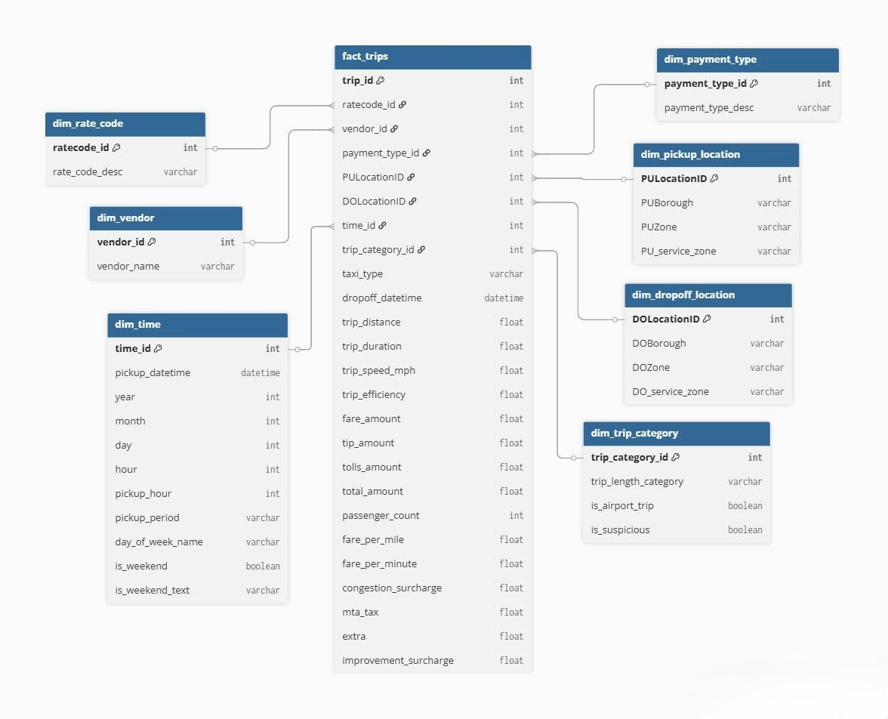

# 🚕 NYC TLC Yellow & Green Taxi Data Pipeline

An end-to-end **Data Engineering** pipeline built with a modern stack using **MinIO**, **Apache Spark**, and dimensional modeling — processing over **48 million** raw rows of NYC taxi trip data (Yellow & Green, year 2024 only) and transforming it into clean, structured, and analytics-ready datasets.

---

## 📌 Project Summary

| Stage        | Description                                                 |
| ------------ | ----------------------------------------------------------- |
| 🔸 Ingestion | 2024 NYC TLC Yellow & Green trip data loaded into **MinIO** |
| 🔸 ETL       | Spark job to clean, deduplicate, and transform raw data     |
| 🔸 Modeling  | Star schema built in **Spark** and exported to PostgreSQL   |
| 🔸 Output    | \~41 million cleaned, modeled rows stored in **PostgreSQL** |

---

## 🧠 Project Architecture

Below is a high-level view of the end-to-end data pipeline architecture:


**Flow Summary:**

- Raw NYC TLC data → MinIO (Data Lake)
- Spark ETL & Modeling
- PostgreSQL (Star Schema)
- Power BI Dashboards

---

## 🛠️ Stack

- ⚙️ **MinIO** – Data lake / object storage
- ⚡ **Apache Spark** (PySpark) – Processing & modeling
- 🐘 **PostgreSQL** – Final star-schema warehouse
- 📊 **Power BI** – Dashboarding and reporting
- 🗂️ **Parquet** – Raw data format (columnar)
- 🐳 **Docker Compose** – Containerized environment

---

## 📥 1. Data Ingestion

Raw data for **2024** (Yellow & Green taxi trips) is downloaded from [NYC TLC Trip Records](https://www.nyc.gov/site/tlc/about/tlc-trip-record-data.page) and uploaded to MinIO.

```bash
# Example: Download and upload to MinIO
wget https://d37ci6vzurychx.cloudfront.net/trip-data/yellow_tripdata_2024-01.parquet
mc alias set localminio http://localhost:9000 minioadmin minioadmin
mc mb localminio/tlc-data
mc cp yellow_tripdata_2024-01.parquet localminio/tlc-data/
```

---

## ⚙️ 2. ETL & Data Cleaning

Using **PySpark**, we:

- ✅ Dropped null & duplicate records
- ✅ Filtered out trips with:
  - Zero/negative distance or fare
  - Pickup/dropoff year outside range
  - Invalid rate codes / payment types
- ✅ Encoded categorical columns
- ✅ Add Columns 

**📊 Before:** `48M rows`\
**🧼 After:** `41M rows`

---

## 🧱 3. Data Modeling (Star Schema)

Data modeling was performed **inside Spark**, producing a well-structured star schema exported to PostgreSQL.


- `fact_trips` 
  
- `dim_time` – Time breakdown (hour, day, month, weekday)
- `dim_vendor` – Taxi vendors (1=Creative, 2=Verifone)
- `dim_payment_type` – Payment methods
- `dim_rate_code` – NYC taxi rate codes
- `dim_pickup_location` – Zones & coordinates
- `dim_dropoff_location` – Zones & coordinates
- `dim_trip_category` – Derived trip types (e.g. short, long)

---

## 🧱 Data Model (Star Schema)

This is the dimensional model used for analytics:



---

## 📈 4. Output & Usage

The final modeled tables are saved to:

- **PostgreSQL** for structured storage
- **Power BI** for dashboarding and data visualization

Power BI connects directly to PostgreSQL to create:

- 📊 Trip distribution analysis
- 💰 Revenue and fare breakdowns
- 📍 Popular pickup/dropoff zones
- ⏱️ Time-based patterns and trends

---


## 📊 Power BI Dashboards


---
